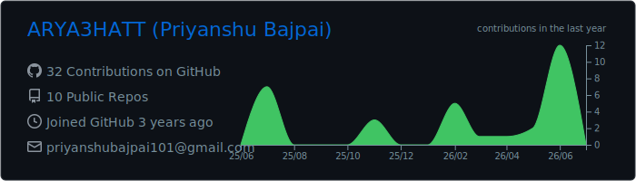
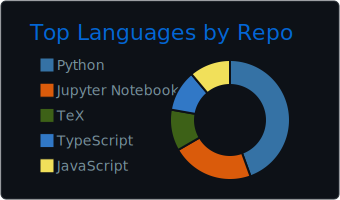

# Priyanshu Bajpai

### 🤖 AI / ML Engineer · Data Science

**End-to-end AI — from data and ML models to LLM agents and the production systems that run them.**

---

##  About Me

I'm a Computer Science graduate (DIT Dehradun) working across **machine learning, data science, and applied LLMs**. I build end to end — from data pipelines and model training to RAG and agent systems and the async backends that serve them.

First-author IEEE researcher, and it's the work I'm proudest of — I care as much about *why* a model fails as whether it works: reliability, retrieval fidelity, and behavior under real constraints.

-  **Best work · Research:** first-author IEEE paper — *Local LLM Architectures for Security-Domain RAG* — under review, **IEEE TEMSMET 2026**
-  **Build across:** ML & data science, RAG & LLM agents, statistical modeling, and production backends (FastAPI, Celery/Redis, Docker)
-  **Ask me about:** ML modeling, retrieval-augmented generation, agentic pipelines, local/quantized LLMs
-  **Open to** Data Science · Machine Learning · AI Engineer roles

##  Currently Working On

-  **Route Resilience** — occlusion-robust road extraction from satellite imagery (Transformer segmentation) + graph-theoretic criticality analysis to surface infrastructure bottlenecks.
-  **Agent-poisoning, measured honestly** *(new collaborative research)* — re-running the major published memory- and tool-poisoning attacks on LLM agents in one identical, offline harness on small *local* models, reporting which results hold up versus collapse, and releasing the harness as an open benchmark.

##  Tech Stack

**Machine Learning & Data Science**
&nbsp;

**GenAI & LLMs**
&nbsp;

**Languages**
&nbsp;

**Backend & Data**
&nbsp;

**DevOps & Cloud**
&nbsp;

**Security**
&nbsp;

##  Featured Projects

| Project | What it does | Links |
|---|---|---|
| ** RAG-Powered VAPT Analyst Agent** | Air-gapped, zero-egress vulnerability-assessment agent on local LLMs. A Parent-Child RAG layer over OWASP Top 10 + NVD/CVE (ChromaDB) maps pentest scan inputs to the right vulnerability contexts via LangChain, then emits JSON-enforced audit reports and CVE/CVSS tables through FastAPI — entirely offline on edge hardware (**68.57% Hit Rate@3**). *The system behind my IEEE paper.* | [Code](https://github.com/ARYA3HATT/sovereign-vapt-x-core) · [Paper](https://github.com/ARYA3HATT/sovereign-vapt-x-paper) |
| ** Energy Plant Anomaly Detection** | Sensor-based anomaly detection for energy plants on a severely imbalanced dataset (0.86% anomalies). Engineered temporal features capturing maintenance cycles plus system-wide aggregates, then rank-averaged an **XGBoost + LightGBM** ensemble with percentile threshold tuning — lifting F1 from a 0.69 baseline to **0.8113** (Ana-Verse 2.0). | [Repo](https://github.com/ARYA3HATT/Energy_Plant_Anamoly_Detection) |
| ** Trader Sentiment Analysis** | How crypto market sentiment (Bitcoin Fear/Greed Index) drives trader behavior and performance on Hyperliquid (Primetrade.ai DS assignment). End-to-end: data cleaning, statistical testing (Mann-Whitney U), K-Means behavioral segmentation, and a time-series-validated classifier predicting next-day profitability (**0.89 Average Precision**), ending in actionable risk strategies. | [Repo](https://github.com/ARYA3HATT/trader-sentiment-analysis) |
| ** AI Product Creative Generation Pipeline** | A 7-node **LangGraph** state machine (research → strategy → generation → multimodal critique → packaging) on async FastAPI + Celery/Redis, with multi-tier fallback chains and a parallel VLM critic that auto-retries low-scoring assets. | [Repo](https://github.com/ARYA3HATT/ai-creative-pipeline) |
| ** Adaptive Diagnostic Engine** | Real-time ability estimation using a 3PL **Item Response Theory** model with Newton-Raphson MLE and Maximum Fisher Information question selection. FastAPI + MongoDB. | [Repo](https://github.com/ARYA3HATT/adaptive-diagnostic-engine) |

##  Activity

---

**Let's build something that ships.** &nbsp;·&nbsp; [Portfolio](https://priyanshubajpai-portfolio.vercel.app) · [LinkedIn](https://linkedin.com/in/priyanshu-bajpai)

